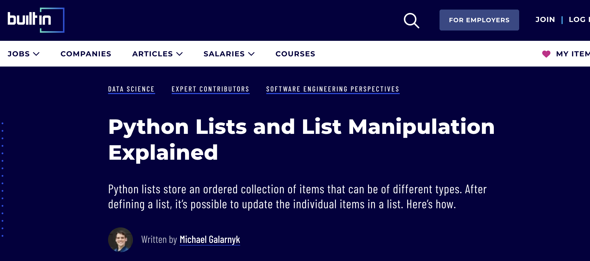

## Blog Post 2: Possible Solutions and errand attempts to develop a solution

The next step for me was to start looking for some educational sourses. I found a rich source of facts at [emdonenilodge.com](https://www.emdonenilodge.com/50-best-fun-random-facts-animals/) and crafted two Python scripts to address these goals.

There have been at least three solutions of how we can implement my **Auto-Generator of Facts about Animals**:

### 1. Static Fact Database:

**Description**: Creating a local database or spreadsheet of animal facts to be referenced and manually inserted.
**Pros**:
- Reduced need for online fetching in real-time.
- Easier organization and management of facts.
**Cons**:
- Limited to the facts in the database.
- Still requires manual effort for insertion.

### 2. External API Integration:

**Description**: Exploring the availability of APIs that provide random animal facts and integrating them into your blog.
**Pros**:
- Potential for a diverse range of facts.
- Automation through API calls.
**Cons**:
- Dependency on third-party APIs.
- May require API key management and potential costs.

### 3. Interactive User Input:

**Description**: Implementing a system where you manually input facts during the writing process but with a user interface or prompts to assist.
**Pros**:
- Retains control over the facts.
- Adds an interactive element to the writing process.
**Cons**:
- Still involves manual input.
- Limited to the facts you are aware of or find during the writing process.

The **[generate_facts_about_animals.py](https://github.com/23W-GBAC/NastLenBlog/blob/main/generate_facts_about_animals.py)** script retrieves facts from the chosen website.

But at the end I decided to choose my own strategy and develop 2 essential Python Scripts for my Automation Project. Especally some articles written on "BuiltIn" helped me to figure out how to manage ordered and unordered lists in Python: 

 
  

### Some Commands and Functionality for [generate_facts_about_animals.py](https://github.com/23W-GBAC/NastLenBlog/blob/main/generate_facts_about_animals.py)

#### Libraries Imported:

- requests: Used for making HTTP requests to the website to fetch content.
- BeautifulSoup: A library for web scraping, employed to parse the HTML content and extract relevant information.

#### Function generate_random_animal_fact():

- Establishes a connection to the specified website and retrieves the HTML content.
- Utilizes BeautifulSoup to locate and extract animal facts from the HTML structure.
- Randomly selects one fact from the obtained list and returns it.

#### Execution in __main__ block:

- Calls the generate_random_animal_fact() function.
- Prints the randomly selected animal fact to the console.

Another my .py skript file [replace_placeholders.py](https://github.com/23W-GBAC/NastLenBlog/blob/main/replace_placeholders.py) seamlessly replaces designated placeholders in my blog posts with dynamically generated facts.

### Some Commands and Functionality:
#### Libraries Imported:

- requests: Similar to the other script, used for making HTTP requests to fetch content.
- generate_random_animal_fact: Importing the function from your first script for obtaining random animal facts.

#### Function replace_fact_placeholder(file_names):

- Accepts a list of file names (your blog posts in Markdown format).
- For each file, reads its content line by line.
Searches for a specific placeholder (**"Did you know? **"**) and replaces it with the dynamically generated animal fact.
- Writes the updated content back to the file.

#### Execution in __main__ block:

- Calls replace_fact_placeholder() with a list of your blog posts (['[Second_Post.md](https://github.com/23W-GBAC/NastLenBlog/blob/main/Second_Post.md)', '[Third_Post.md](https://github.com/23W-GBAC/NastLenBlog/blob/main/Third_Post.md)', '[Fourth_Post.md](https://github.com/23W-GBAC/NastLenBlog/blob/main/Fourth_Post.md)']).
- Prints the updated content to the console.

Additional Notes:
This script is designed to be run after creating your blog posts, ensuring that the placeholders are correctly positioned in your Markdown files.
