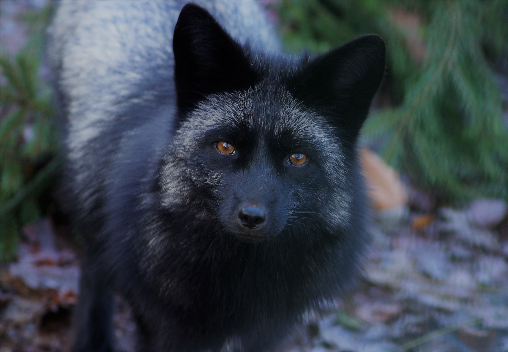

# Exploring Why Some Animals Win Our Hearts and Others Pose a Challenge

I always wondered why we, humans - animals from a biological prospective - can get along with some specific types of animals, such as cats, dogs, turtles, bunnies, etc., and at the same time not be able to endure a second in a calm vibe with others (e.g foxes and wolves, which are related to members of the Canidae family as well as our all familiar household dogs)? 

Perhaps there exists an unnoticed similarity between us and our beloved pets? Which factors have mostly influenced our connection?

In order to get some clear guesses on these questions, we need to take a look at human’s historical interaction with certain types of animals. 

The first and major aspect is domestication. Throughout human history, people tried to selectively breed and genetically adapt several kinds of species. This process has become successful with particular living creatures. According to the article in National Geographic, humans have managed to develop three major domesticating groups: companionship (dogs and cats), animals farmed for food (sheep, cows, ducks, etc.), and working on draft animals (horses, donkeys, camels). Such facts as [“Near Eastern and Egyptian populations of Felis silvestris lybica contributed to the gene pool of the domestic cat at different historical times”](https://www.nature.com/articles/s41559-017-0139.epdf?sharing_token=a-9BmmTKbme_7rk_Wb7KJdRgN0jAjWel9jnR3ZoTv0P1-hlCK4xw03Oq1bTQkuMRxu0CVri32-8BYKho-FYR13zfxre5GLJcd4_0LmLN4VEXjB6NSx3DrZ2P--bES4XzdX8f6vgAk7S5GxG11GPRIW5F1R-kzl0blu7b5vt-r5ECqD2WOxdtIzAp4RtzruH8MGYQn91anq5PrjerVMabheRp2DZB4UaCVFdollXT9Hk%3D&tracking_referrer=www.nationalgeographic.com) were truly recorded. It makes us reflect on evolutionary developed connections related to these groups of domestication.

The scientists separate the concept of domestication from the principle of taming. Taming is generally not evolutionary and refers to the process of adaptation of individual living organisms to specific human conditions. The major aim of taming is to create for some individuals of the species more comfortable and interconnection with humans. 

  

A worldwide known contribution to the study of the process of domestication was made by Russian (Soviet) geneticist and academician Dmitry Belyayev. In 1950, he started a long-term research project “Silver Fox Domestication Experiment”, involving the cultivation of silver foxes (Vulpes vulpes) with the major objective of recreating the evolution of gray wolf to a domesticated pet dog.
Essentially, the program became a success within 10 generations. He wrote in 1979: “Like dogs, these foxes seek contact with familiar persons, tend to get close to them, and lick their hands and faces.” - the silver foxes finally evolved to behave like dogs and were getting more friendly.

  

Some people still do not leave Belyaev’s works aside. Our contemporaries [David and Amy Bassett](https://www.kpbs.org/news/local/2023/04/28/russian-domesticated-foxes-trained-nosework-save-lives-santa-ysabel)  care for orphaned coyotes, New Guinea singing dogs, artic and fur-farm fox rescues, a gray wolf and 14 Russian domesticated foxes. David pointed out that these foxes are not timid and do not try to keep a flight distance. Moreover, they enjoy being kissed, held, and treated - exactly like babies.

The second no less important thing is the emotional aspect. If we consider a pet cat, it is understandable that there exists a strong bond between it and a human, since the cat feels comfortable under common, secure conditions and can perceive human attention, touch, and petting. In contrast, a wild cat named Caracal, which we can find in some parts of Africa, will be extremely likely to threaten, if not with injuries, then the whole human life. This behavior is nothing but survival instinct - if such a situation happens that a Caracal meets a human, in 95% of cases their first reaction will be aggression. For Caracals it would be rather fearful and stressful to meet an “alien” in their usual environment. Hence, instinctively, they begin succumbing to their life-saving skills and start defending themselves and, even worse, attacking a human. There are thousands of related to Caracal creatures that are able to build positive human-animal relationships with a low probability.
