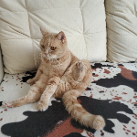

Did you know? **The only mammals to undergo menopause are elephants, humpback whales and human females.**

As I mentioned in the beginning of our journey through intriguing topics about our beloved creatures, I began writing this blog not exactly for entertainment, but for a particular objective.
I want to share the sad, but rather instructive story with you which is described from my personal experience.

<!--  -->

This is my cat Marquis. A kind, calm, and docile British breed cat with enchanting amber eyes. Frankly speaking, he was like “the angel in the flash” who doesn’t appreciate making any kind of noise or trying to bother someone. He was even a little distant. In a nutshell, it was a surprisingly rare animal.

Marquis started to get sick when I was a teenager. At first, he developed [kidney stones](https://en.wikipedia.org/wiki/Kidney_stone_disease) that made him unable to sleep normally. He was still young enough to take on different types of diseases. After a while, things were only getting worse.
I was the first to notice that Marquis had started to limp. I was very concerned about this, and we tried to treat him in every possible way - pills, powders, injections. We thought osteoarthritis or the heart pain were the main causes of this. The diagnoses of many doctors showed this. Time passed, and nothing helped. 

One day, both of the Marquis’s hind paws failed - they stopped 
functioning in any way. All he could to is to crawl on his two front paws. It was terrifying for all of us. My beloved pet, a member of a family was suffering, and we couldn’t bear it. We realised that an urgent operation was needed. It was very painful for an animal, since it involved the installation of the prosthetis on the hind legs. The very thought of my poor cat being disabled strongly depressed me. 